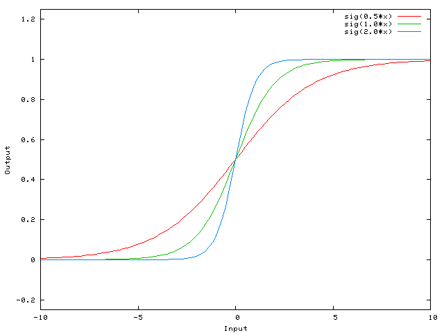

# Bias in Neural Network

This is an answer for a [question on StackOverflow](http://stackoverflow.com/a/2499936/1567340) and I find it very useful, so I quote it here.

Biases are almost always helpful. In effect, **a bias value allows you to shift the activation function to the left or right**, which may be critical for successful learning.

It might help to look at a simple example. Consider this 1-input, 1-output network that has no bias:

The output of the network is computed by multiplying the input (x) by the weight (w0) and passing the result through some kind of activation function (e.g. a sigmoid function.)

Here is the function that this network computes, for various values of w0:

Changing the weight w0 essentially changes the "steepness" of the sigmoid. That's useful, but what if you wanted the network to output 0 when x is 2? Just changing the steepness of the sigmoid won't really work -- **you want to be able to shift the entire curve to the right.**

That's exactly what the bias allows you to do. If we add a bias to that network, like so:

...then the output of the network becomes sig(w0*x + w1*1.0). Here is what the output of the network looks like for various values of w1:

Having a weight of -5 for w1 shifts the curve to the right, which allows us to have a network that outputs 0 when x is 2.
