# Solving Linear Regression problems with Gradient Descent

Linear Regression is one of the simplest problem that Machine Learning can be applied. Let's first take a look at the training data:

## The Data Set

Let's say, we have the data represent the relationship between age and weight of boys (taken from [Google Chart project](https://developers.google.com/chart/interactive/docs/gallery/scatterchart)):

| Age | Weight |
|-----|--------|
|  8  |   12   |
|  4  |  5.5   |
| 11  |   14   |
|  4  |    5   |
|  3  |  3.5   |
| 6.5 |    7   |

The chart below represent the dataset:

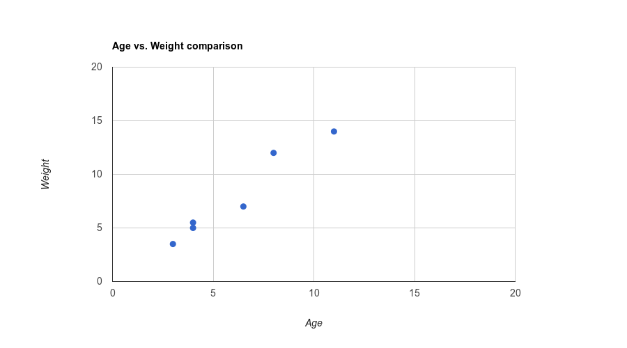

### Hypothesis function 

To perform the learning algorithm, we must decide how we're going to represent the dataset above in the form that computer could "understand".

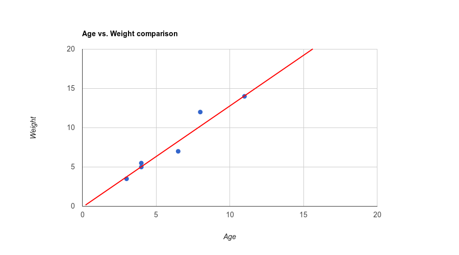

Looking at the chart above, we see the red line is how the data is (approximately) distributed. We call this is a **model** of our dataset, this is how a computer can "understand" the data, and the function that represent this model is called **hypothesis function**

We call `h(x)` is a function that represent the data model:

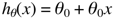

The θ are **parameters** (also called **weights**), this is the key of our learning algorithm, as you see, since `x` are fixed by the training data, value of `h(x)` will change if the **parameters** changes.

What we need to do is optimizing θ values so the **hypothesis function** will fit the data model. To do so, we need to check the distance value between real data target values (`y`) and the value of `h(x)` respect to the value of θ. This called **cost function**.

### Cost Function

Below is a fomular of a **cost function**:

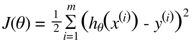

Since this function tell us how wrong our model is, the more minimum the value of **cost function** is, the more accurate our **hypothesis function** be.

To minimize **cost function**, we can use **Gradient Descent Algorithm** or **Normal Equation**

## Gradient Descent 

There are 2 types of Gradient Descent algorithm: **Batch Gradient Descent** and **Stochastic Gradient Descent**

The general idea of both algorithms is: "Start with an initial θ, repeatly change θ to make J(θ) smaller. Until _hopefully_ we converge to a value of θ that minimizes J(θ)".

Then, how do we change the θ? We modify the value of θ by this formular:

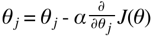

This update must be **simultaneously** for all values of j = 0,...,n. It's recommended to take a look at [this notes](http://www.holehouse.org/mlclass/04_Linear_Regression_with_multiple_variables.html) for what exactly is simultaneously update.

By doing some math, we can work out the **partial derivative** of  the **cost function**:

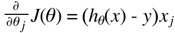

So, for single training example, we have the formular to optimize the theta:

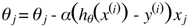

This rule is called **LMS (Least Mean Squares) Update Rule**.

There are **two ways** to train a set of example data using LMS update rule, and it's the two algorithms that we mentioned in the beginning of this section.

### Batch Gradient Descent

The algorithm:

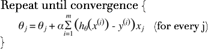

Which "repeat until convergence" here is when the **cost function** reached its minimum value (we can say: ≈0)

As you noticed the `sum` of `m` (amount of traning set) here. In this algorithm we _look at **every example** in the training set on **every step**_

Here is the implement of **Batch Gradient Descent** in Swift: 

```
func batchGradientDescent(steps: Int, x: [Double], y: [Double], learningRate: Double) -> [Double] {
    var theta = [0.0, 0.0]
    for _ in 0..<steps {
        for j in 0..<theta.count {
            let h = hypothesisFunction(theta: theta)
            var sum = 0.0
            for i in 0..<x.count {
                sum = sum + ((h(x[i]) - y[i]) * x[j])
            }
            theta[j] = theta[j] - learningRate * (1.0/Double(x.count)) * sum
        }
    }
    return theta
}
```

**Note:** In the implement above, I actually replaced the convergence condition by `steps` value, so instead of running the algorithm until **cost function** reached zero value, we can just run the algorithm as many time as possible (for example: `step = 10000`)

### Stochastic Gradient Descent

The alternative for **Batch Gradient Descent** is **Stochastic Gradient Descent**, which as the algorithm as describled below:

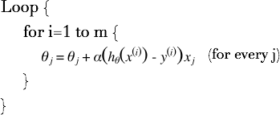

In this algorithm, we _repeatedly run through the training set and with **every example** in the training set, we update the parameters according to the gradient of the error with respect to that **single traing example only**_

The implement of **Stochastic Gradient Descent** in Swift:

```
func stochasticGradientDescent(steps: Int, x: [Double], y: [Double], learningRate: Double) -> [Double] {
    var theta = [0.0, 0.0]
    for _ in 0..<steps {
        let h = hypothesisFunction(theta: theta)
        for i in 0..<x.count {
            for j in 0..<theta.count {
                theta[j] = theta[j] - learningRate * ((h(x[i]) - y[i]) * x[j])
            }
        }
    }
    return theta
}
```

### Compare BGD and SGD

In short, **Batch Gradient Descent** has to _scan through the **entrie training set** before taking a **single step**_. The **Stochastic Gradient Descent** can start making the progress **right away**, and continue making progress with **each example** it look at.

Because of this, **SGD** will get the parameters to the mimimum much faster than **BGD**, but the parameters θ will keep oscillating around the mimimum of J(θ), not actually reached the mimimum as **BGD** does.

So, in large training set, stochastic gradient descent is a better choice than batch gradient descent.

## Code

You can take a look at the Swift implementation of both Batch Gradient Descent and Stochastic Gradient Descent of the above training set in this Playground file.

Download: [GradientDescent.playground](GradientDescent.playground)

Or run online here: [IBM Swift Sandbox: Gradient Descent Implementation](http://swiftlang.ng.bluemix.net/#/repl/57ea13f5a5a521463c4be708)

The output of the program should be:

```
Batch Gradient Descent Training:  [0.4322766570605191, 0.85590778097982612]
Age = 1, Weight =  1.28818443804035
Age = 2, Weight =  2.14409221902017
Age = 3, Weight =  3.0
Age = 4, Weight =  3.85590778097982
Age = 5, Weight =  4.71181556195965
Age = 6, Weight =  5.56772334293948
Age = 7, Weight =  6.4236311239193
Age = 8, Weight =  7.27953890489913
Age = 9, Weight =  8.13544668587895
```

The graph below show how the **cost** changes during the progress of **Batch Gradient Descent**

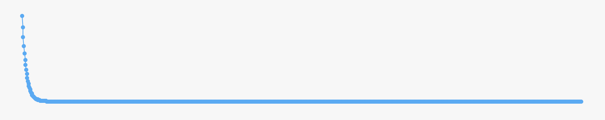

```
Stochastic Gradient Descent Training:  [0.42857142857142855, 0.8571428571428571]
Age = 1, Weight =  1.28571428571429
Age = 2, Weight =  2.14285714285714
Age = 3, Weight =  3.0
Age = 4, Weight =  3.85714285714286
Age = 5, Weight =  4.71428571428571
Age = 6, Weight =  5.57142857142857
Age = 7, Weight =  6.42857142857143
Age = 8, Weight =  7.28571428571429
Age = 9, Weight =  8.14285714285714
```

And this graph show how the **cost** changes during the progress of **Stochastic Gradient Descent**

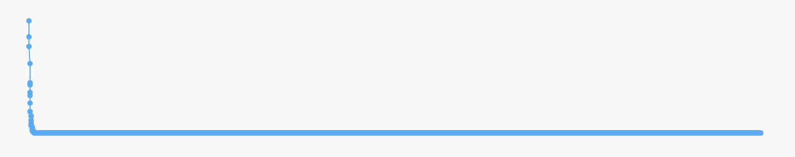

Based on these graphs, we see that **SGD** algorithm help the **cost function** reachs its minimum faster than **BGD** algorithm.
